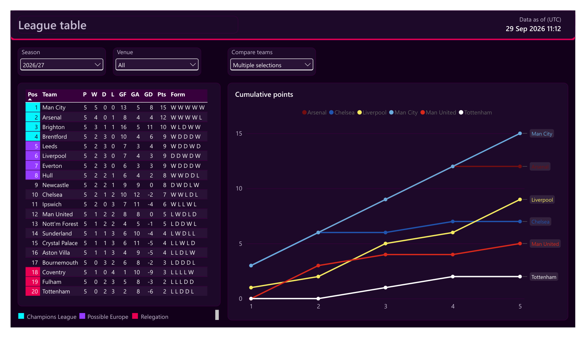
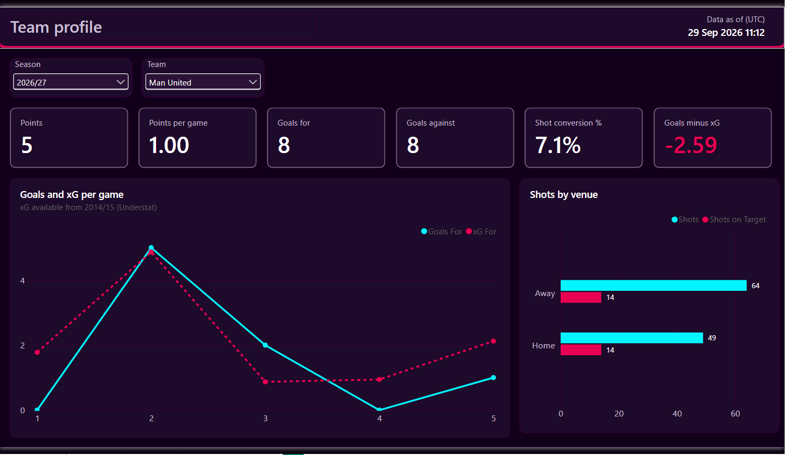
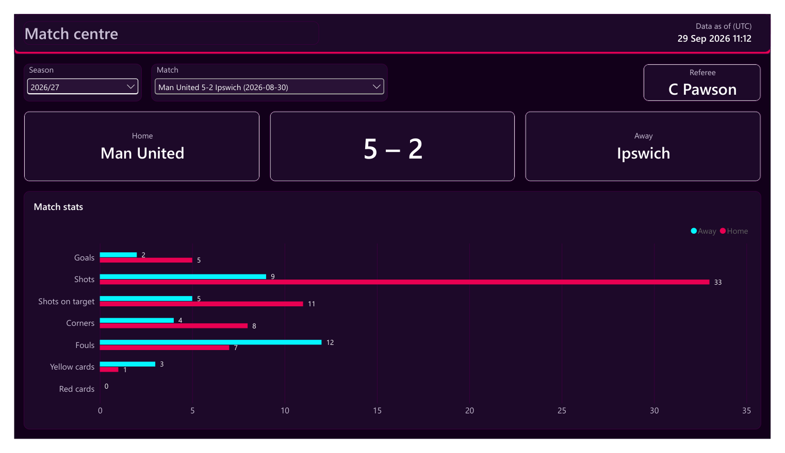
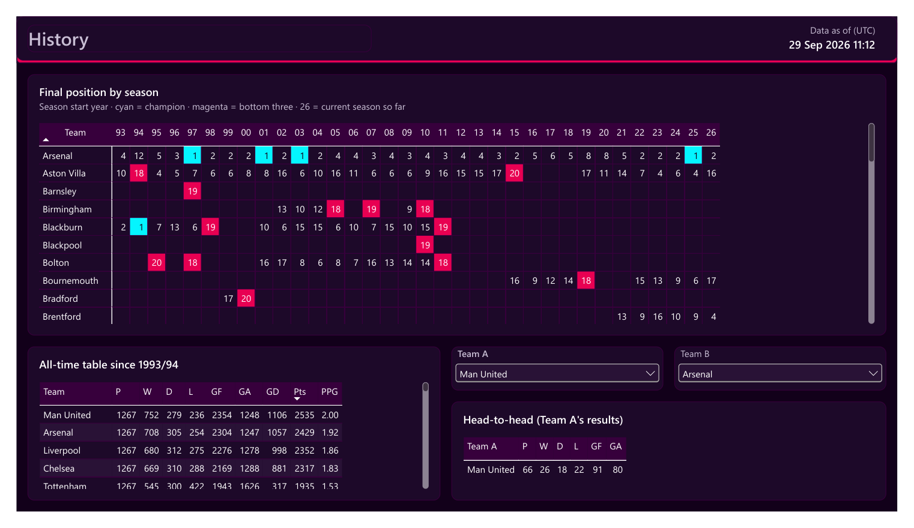

# Premier League Stats Hub

Every Premier League match since 1993/94, loaded by a tested Python pipeline into PostgreSQL and explored in Power BI and Excel.



## What it shows

- **League table**: standings for any season and venue, with form and a cumulative points race for chosen teams.
- **Team profile**: a team's points, goals, shot conversion and goals minus xG, plus goals vs xG per game and shots by venue.
- **Match centre**: the score, referee and side-by-side stats for any single match.
- **History**: final position of every club in every season, the all-time table, and head-to-head records.

<details>
<summary>Screenshots of the other pages</summary>





</details>

The Excel workbook (`analytics/pl_stats_hub.xlsx`) has a dashboard built on the same mart.

## How it works

```
football-data.co.uk CSVs ─┐
                          ├─> ingest modules ─> PostgreSQL staging ─> pytest ─> publish to mart ─> Power BI + Excel
Understat xG (soccerdata) ┘   (data/ingest)     (staging schema)      (gate)    (mart schema)     (+ CSV copies in data/marts)
```

## Engineering

- **Config file**: seasons, paths, schemas and HTTP settings live in `config.toml`; credentials in `.env` (see `.env.example`).
- **Logging with run IDs**: every run gets an ID, logged to the console and a rotating `logs/pipeline.log`.
- **HTTP retries**: requests retry with backoff on 429 and 5xx responses.
- **Download validation**: each file must parse as CSV and have the expected columns before it is saved.
- **Test gate before export**: the test suite runs against staging; if any test fails, nothing is published.
- **`pipeline_runs` log**: each run's status, error and row count are written to `ops.pipeline_runs` (and `data/marts/pipeline_runs.csv`).

## How to run

```
pip install -r requirements.txt
python -m data.pipeline
```

Then open `analytics/pl_stats_hub.pbix` and `analytics/pl_stats_hub.xlsx` and refresh both. Run `python -m data.pipeline --help` for options (`--full-refresh`, `--skip-ingest`, `--log-level`).

## Data credits

- Results and match stats: [football-data.co.uk](https://www.football-data.co.uk/). Match stats (shots, corners, fouls, cards) start in **2000/01**; earlier seasons have results only (checked with `data/checks.py`).
- Expected goals: [Understat](https://understat.com/) via [soccerdata](https://github.com/probberechts/soccerdata). xG starts in **2014/15**.

Data problems found and how they are handled are in [`analytics/notebooks/FINDINGS.md`](analytics/notebooks/FINDINGS.md).

## Limits

No possession, passing or player-level data.
