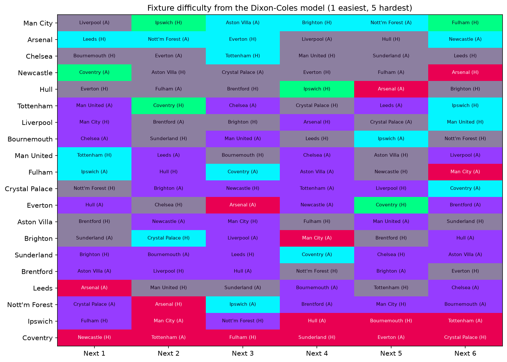

# Premier League Stats Hub

Every Premier League match since 1993/94, loaded by a tested Python pipeline into PostgreSQL and explored in Power BI and Excel.


## What it shows

- **League table**: standings for any season and venue, with form and a cumulative points race for chosen teams.
- **Team profile**: a team's points, goals, shot conversion and goals minus xG, plus goals vs xG per game and shots by venue.
- **Match centre**: the score, referee and side-by-side stats for any single match.
- **History**: final position of every club in every season, the all-time table, and head-to-head records.

<details>
<summary>Screenshots of the other pages</summary>


</details>

The Excel workbook (`analytics/pl_stats_hub.xlsx`) has a dashboard built on the same mart.

## How it works

```
football-data.co.uk CSVs ─┐
                          ├─> ingest modules ─> PostgreSQL staging ─> pytest ─> publish to mart ─> Power BI + Excel
Understat xG (soccerdata) ┘   (data/ingest)     (staging schema)      (gate)    (mart schema)     (+ CSV copies in data/marts)
```

## Engineering

- **Config file**: seasons, paths, schemas and HTTP settings live in `config.toml`; credentials in `.env` (see `.env.example`).
- **Logging with run IDs**: every run gets an ID, logged to the console and a rotating `logs/pipeline.log`.
- **HTTP retries**: requests retry with backoff on 429 and 5xx responses.
- **Download validation**: each file must parse as CSV and have the expected columns before it is saved.
- **Test gate before export**: the test suite runs against staging; if any test fails, nothing is published.
- **`pipeline_runs` log**: each run's status, error and row count are written to `ops.pipeline_runs` (and `data/marts/pipeline_runs.csv`).

## How to run

```
pip install -r requirements.txt
python -m data.pipeline
```

Then open `analytics/pl_stats_hub.pbix` and `analytics/pl_stats_hub.xlsx` and refresh both. Run `python -m data.pipeline --help` for options (`--full-refresh`, `--skip-ingest`, `--log-level`).

## P2 — Match prediction and season simulation

A Premier League match model that predicts every 2026/27 fixture before kick-off, simulates the rest of the season into title, top-four and relegation probabilities, and reports honestly how close it gets to the bookmakers — plus a hand-built xG model on StatsBomb event data. The code is in `modelling/`.

### Match model vs the bookmakers

Over 2,660 matches from 2019/20 to 2025/26, the Dixon–Coles model scored a mean RPS of 0.2039, against 0.1968 for market-average closing odds: a gap of 0.0071 (95% bootstrap interval 0.0046 to 0.0095). The model does not beat the closing market. Its probabilities are well calibrated, and it beats both baselines in every season.

| Forecast (walk-forward, refitted weekly) | RPS | Log loss |
|---|---|---|
| Closing odds (benchmark) | 0.1968 | 0.9639 |
| Dixon–Coles | 0.2039 | 0.9935 |
| Plain Poisson (no low-score correction) | 0.2039 | 0.9932 |
| Equal-strength Poisson (baseline) | 0.2338 | 1.0712 |
| League frequencies (baseline) | 0.2339 | 1.0710 |

Lower is better. The low-score correction made no measurable difference here: plain Poisson scores the same.


### Season simulation

10,000 simulated seasons, as of 2 October 2026 (five matches played by each team):

| Team | Expected points | Title | Top four | Relegation |
|---|---|---|---|---|
| Man City | 80.4 | 53.9% | 99.0% | 0.0% |
| Arsenal | 79.0 | 42.8% | 98.5% | 0.0% |
| Liverpool | 64.7 | 2.1% | 58.0% | 0.0% |
| Brighton | 60.2 | 0.6% | 33.8% | 0.1% |
| Hull | 58.9 | 0.2% | 25.3% | 0.2% |
| … | | | | |
| Tottenham | 39.7 | 0.0% | 0.1% | 37.1% |
| Ipswich | 29.4 | 0.0% | 0.0% | 91.5% |
| Coventry | 15.2 | 0.0% | 0.0% | 100.0% |

The promoted teams (Hull, Ipswich, Coventry) are rated on five matches only, so their numbers are overconfident; see Limits.

Each week's predictions are written to the `predictions` schema and committed to `modelling/predictions/` at least a day before kick-off. A ledger then scores each match's first prediction against the result and the closing odds (`modelling/ledger/`).

### xG model

Trained on 38,728 shots from StatsBomb Open Data 2015/16 and scored on a held-out 20% of matches (7,725 non-penalty shots):

| Model | Log loss | AUC |
|---|---|---|
| Constant goal rate (baseline) | 0.3187 | 0.500 |
| Distance only (baseline) | 0.2816 | 0.751 |
| Logistic regression | 0.2646 | 0.793 |
| LightGBM | 0.2631 | 0.798 |
| StatsBomb's own xG (reference, uses player positions) | 0.2494 | 0.824 |

LightGBM's expected calibration error is 0.009, and its total xG on the test set is 750.3 against 750 goals. Distance and angle are the two strongest features (SHAP).


### FPL add-ons

- **Fixture difficulty**: a 1–5 rating for each team's next six fixtures, from the model's win probability (1 = 65% or more, 2 = 50%, 3 = 35%, 4 = 20%, 5 = below 20%).
- **Squad optimiser**: the 15-player squad with the highest projected points over the next five gameweeks, solved as a mixed-integer linear program. Budget, squad and formation rules are read from the FPL API. On 2 October 2026 (gameweeks 6–10) it spent 100.0 of 100.0 and projected 303 points for the starting XI, with Haaland as captain: [`fpl_squad.csv`](modelling/reports/fpl_squad.csv). The projection counts appearances, goals, assists, clean sheets and goals conceded only.



### More detail

- [Match model card](modelling/MODEL_CARD_match.md)
- [xG model card](modelling/MODEL_CARD_xg.md)
- [Results report](modelling/reports/P2_REPORT.md)

### How to run P2

```
python -m data.ingest.statsbomb        # once: 2015/16 shots (slow)
python -m data.pipeline                # weekly: results, odds, fixtures
python -m modelling.xg.train           # xG models
python -m modelling.xg.evaluate        # calibration and SHAP figures
python -m modelling.match.ratings      # current team ratings
python -m modelling.match.backtest     # walk-forward backtest (up to an hour)
python -m modelling.match.benchmark    # compare with closing odds
python -m modelling.match.simulate     # season simulation
python -m modelling.match.predict      # publish next week's predictions; commit them before kick-off
python -m modelling.match.ledger       # score published predictions
python -m modelling.match.fdr          # fixture difficulty
python -m data.ingest.fpl              # FPL players, prices and rules
python -m modelling.match.fpl_squad    # FPL squad optimiser
```

## Data credits

- Results, match stats and odds: [football-data.co.uk](https://www.football-data.co.uk/). Match stats (shots, corners, fouls, cards) start in **2000/01**; earlier seasons have results only (checked with `data/checks.py`). Closing odds start in **2019/20**.
- Expected goals and fixtures: [Understat](https://understat.com/) via [soccerdata](https://github.com/probberechts/soccerdata). xG starts in **2014/15**.
- Shot events for the xG model: data provided by [StatsBomb](https://github.com/statsbomb/open-data) (Open Data, 2015/16). Only 34 Bundesliga and 377 Ligue 1 matches were available, so the model has 1,551 matches, not 1,826.
- Players, prices and game rules for the squad optimiser: the [Fantasy Premier League](https://fantasy.premierleague.com/) API.

Data problems found and how they are handled are in [`analytics/notebooks/FINDINGS.md`](analytics/notebooks/FINDINGS.md).

## Limits

- P1: no possession, passing or player-level data.
- The match model uses goals only: no injuries, line-ups, transfers or manager changes. It does not beat closing odds.
- A team with only a few matches in the three-year window gets an unregularised rating. After five matches Coventry's relegation probability is 100%, which is too confident.
- The xG model has one season (2015/16) and no player-position features.
- The FPL projection ignores saves, bonus points, cards, penalties and defensive contributions.
