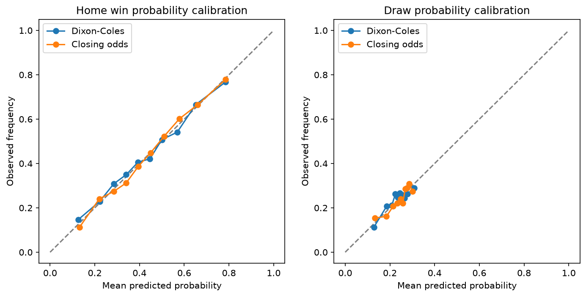
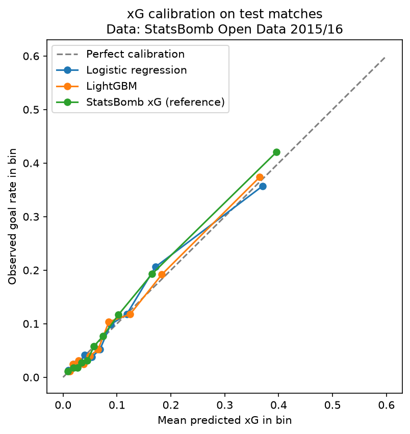
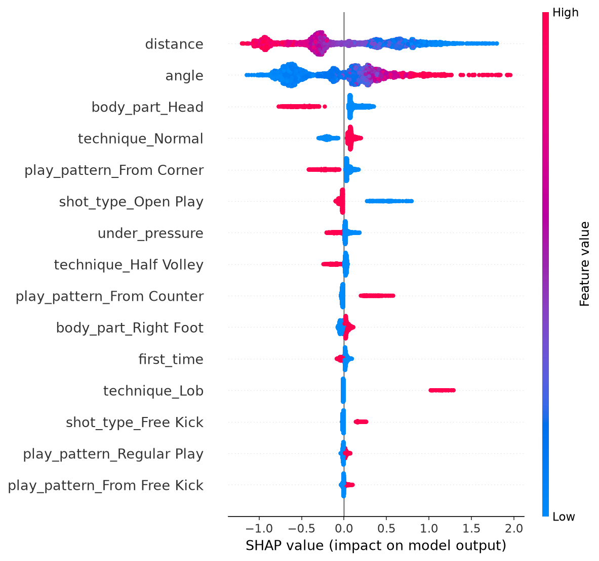

# P2 report — Match prediction and season simulation

## The question
Can a simple, transparent model forecast Premier League matches well?

## The answer in three numbers
| | |
|---|---|
| Dixon–Coles RPS | 0.2039 |
| Closing-odds RPS | 0.1968 |
| Gap | 0.0071 (95% bootstrap interval 0.0046 to 0.0095) |

Over 2,660 matches from 2019/20 to 2025/26, refitted every week on past matches only.
Lower is better. The model does not beat the closing market. Its probabilities are well
calibrated, and it beats both baselines in every season.

## Match model

RPS by season:

| Season | Dixon–Coles | Closing odds | Gap | Equal-strength Poisson | League frequencies |
|---|---|---|---|---|---|
| 2019/20 | 0.2014 | 0.1985 | 0.0028 | 0.2300 | 0.2303 |
| 2020/21 | 0.2165 | 0.2109 | 0.0055 | 0.2441 | 0.2435 |
| 2021/22 | 0.1970 | 0.1889 | 0.0080 | 0.2352 | 0.2351 |
| 2022/23 | 0.2116 | 0.1975 | 0.0141 | 0.2303 | 0.2308 |
| 2023/24 | 0.1890 | 0.1808 | 0.0082 | 0.2342 | 0.2341 |
| 2024/25 | 0.2018 | 0.1961 | 0.0057 | 0.2352 | 0.2358 |
| 2025/26 | 0.2100 | 0.2045 | 0.0055 | 0.2277 | 0.2279 |

The gap to the market was largest in 2022/23 and smallest in 2019/20. Plain Poisson
(no low-score correction) scores the same RPS as Dixon–Coles, 0.2039, so the correction
added nothing measurable.

## xG model
On 7,725 held-out shots, LightGBM reaches a log loss of 0.2631 and an AUC of 0.798,
against 0.3187 and 0.500 for a constant goal rate and 0.2494 and 0.824 for StatsBomb's
own xG. Its expected calibration error is 0.009. Data provided by StatsBomb.

## Season simulation, 2 October 2026
10,000 simulated seasons, five matches played by each team.

| Title | Probability | | Relegation | Probability |
|---|---|---|---|---|
| Man City | 53.9% | | Coventry | 100.0% |
| Arsenal | 42.8% | | Ipswich | 91.5% |
| Liverpool | 2.1% | | Tottenham | 37.1% |
| Brighton | 0.6% | | Crystal Palace | 20.9% |
| Hull | 0.2% | | Fulham | 18.5% |

## Live ledger so far
No match has been scored yet. The first prediction run, on 2 October 2026, fell in an
international break with no fixture inside the 7-day window. The ledger starts with the
10 October matchweek: [../ledger/](../ledger/)

## Limitations
- The match model uses goals only: no injuries, line-ups, transfers or manager changes.
- Promoted teams are rated on five matches, without regularisation, so their numbers
  above are overconfident.
- The simulation breaks ties at random after points, goal difference and goals.
- The xG model has one season (2015/16), no player-position features and almost no
  Bundesliga data.

Details: [match model card](../MODEL_CARD_match.md), [xG model card](../MODEL_CARD_xg.md).

## Next steps
- P4 will query the `predictions` tables.
- P5 will serve the model and schedule the weekly run.
